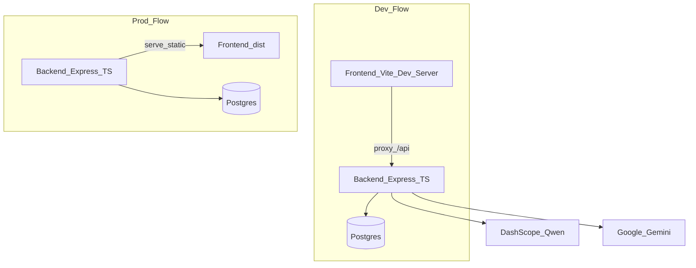

# PawTrace 完整前后端改造计划 / PawTrace Full-Stack Rebuild Plan

## 目标状态（你选定的技术路线） / Target State (Chosen Technical Direction)

- **前端 / Frontend**：React + TypeScript + Vite + Tailwind（组件化、可维护、可构建部署 / component-based, maintainable, and ready for build/deployment）
- **后端 / Backend**：Node.js + TypeScript + Express
- **数据库 / Database**：Postgres + Prisma（规范 schema/迁移/种子数据 / standardized schema, migrations, and seed data）
- **鉴权 / Authentication**：默认采用 **JWT（Access Token）** + 密码哈希（bcrypt/argon2） / default to **JWT (Access Token)** plus password hashing (bcrypt/argon2)
- **AI**：保留后端代理（Qwen / Gemini），前端不接触密钥 / keep backend AI proxying for Qwen/Gemini so secrets never reach the frontend

## 现状关键点（来自当前仓库） / Current State Highlights (From the Existing Repo)

- 当前推荐启动是 `backend/server.js` 同时托管静态与 API，`frontend/dist` 不存在会回退托管 `frontend/` 源码（需改成标准 dev/prod 分离） / The current startup path uses `backend/server.js` to serve both static assets and APIs, and falls back to raw `frontend/` source when `frontend/dist` is missing, which should be replaced with a standard dev/prod split.
- 后端路由集中在 `[backend/routes/registerRoutes.js](backend/routes/registerRoutes.js)`，包含 pets/users/chat/history/status/location/health/nfc/monitor 等 / Backend routes are centralized in [backend/routes/registerRoutes.js](/Users/jeremy/Desktop/Group1-pawtrace/backend/routes/registerRoutes.js), covering pets/users/chat/history/status/location/health/nfc/monitor and more.
- AI 相关在 `[backend/services/aiService.js](backend/services/aiService.js)` 及路由中调用 DashScope/Gemini / AI-related logic lives in [backend/services/aiService.js](/Users/jeremy/Desktop/Group1-pawtrace/backend/services/aiService.js) and route handlers calling DashScope/Gemini.
- 前端现在是原生 JS，大体入口为 `frontend/src/main.js`，且 `frontend/src/app.js` 过大（需拆分/重写为 React 组件） / The frontend is currently plain JavaScript, mainly entering through [frontend/src/main.js](/Users/jeremy/Desktop/Group1-pawtrace/frontend/src/main.js), and [frontend/src/app.js](/Users/jeremy/Desktop/Group1-pawtrace/frontend/src/app.js) is too large and should be split/rebuilt as React components.

## 目标架构（开发与生产） / Target Architecture (Development and Production)

## 目录与脚本（规划） / Directory and Scripts (Planned)

- 根目录使用 workspaces（或保持简单的 `--prefix`，但会统一成标准体验） / Use workspaces at the repo root, or keep `--prefix` temporarily, but converge on a standard developer experience.
- 预期结构 / Expected structure:
  - `backend/`：TS 源码、Prisma schema、迁移、路由、服务 / TS source, Prisma schema, migrations, routes, and services
  - `frontend/`：React 应用（Vite） / React app (Vite)
  - `packages/shared/`（可选） / `packages/shared/` (optional): 共享类型（API DTO、Zod schema / shared types, API DTOs, Zod schemas）

## 具体实施步骤 / Implementation Steps

### 1) 仓库卫生与可复现安装 / Repository Hygiene and Reproducible Setup

- 增加/修正根级 `.gitignore`：忽略 `**/node_modules`、`**/.DS_Store`、本地 DB/日志、构建产物等 / Add or fix the root `.gitignore` to exclude `**/node_modules`, `**/.DS_Store`, local DB/log files, build output, and similar artifacts.
- 将已入库或变更中的 `backend/node_modules/**` 从版本控制中移除（保留 lockfile） / Remove committed or changed `backend/node_modules/**` from version control while keeping the lockfile.
- 将本地数据库文件（如 `backend/data/pawtrace.sqlite`）改为本地生成，不再入库；提供 `seed` 和 `migrate` 代替 / Convert local DB files such as `backend/data/pawtrace.sqlite` into generated local artifacts and replace them with `seed` and `migrate` workflows.

### 2) 后端脚手架（TS + Express + Prisma + Postgres） / Backend Scaffold (TS + Express + Prisma + Postgres)

- 初始化 TypeScript 工程、统一配置加载（dotenv）、结构化日志、全局错误处理 / Initialize the TypeScript project with dotenv-based config loading, structured logging, and global error handling.
- 加入基础安全与可观测性：Helmet、CORS、压缩、请求 ID、健康检查 `/api/status` / Add baseline security and observability via Helmet, CORS, compression, request IDs, and a `/api/status` health check.
- Prisma：建立核心模型（User、Pet、ChatMessage/Conversation、LocationPoint、HealthMeasurement、NfcCard 等）与迁移 / Use Prisma to define core models such as User, Pet, ChatMessage/Conversation, LocationPoint, HealthMeasurement, NfcCard, and related migrations.

### 3) 鉴权与权限 / Authentication and Authorization

- 注册/登录：密码哈希、登录发 token、前端持久化（httpOnly cookie 或 localStorage，默认先做 Bearer JWT） / Implement signup/login with password hashing, token issuance, and frontend persistence through httpOnly cookies or localStorage, defaulting to Bearer JWT first.
- 将现有“设备 token”（`x-device-token`）概念升级为设备表 + device token 哈希存储，或保留 env 白名单但用更清晰的中间件与配置 / Upgrade the current `x-device-token` model into a device table with hashed tokens, or keep an env allowlist with clearer middleware and config.
- 对 `/api/health/*`、`/api/location/*(写)`、`/api/monitor/*`、`/api/nfc/*(签名)` 等加保护 / Protect routes such as `/api/health/*`, write-side `/api/location/*`, `/api/monitor/*`, and signed `/api/nfc/*`.

### 4) API 迁移与兼容层 / API Migration and Compatibility Layer

- 以当前 `[backend/routes/registerRoutes.js](backend/routes/registerRoutes.js)` 为功能清单，逐个迁移到新路由模块 / Use [backend/routes/registerRoutes.js](/Users/jeremy/Desktop/Group1-pawtrace/backend/routes/registerRoutes.js) as the migration checklist and move features into new route modules one by one.
- 尽量保持原有路径与响应结构，减少前端迁移成本；必要时提供 `/api/v2/*` 并在前端切换 / Keep existing paths and response shapes where possible to reduce frontend migration cost; add `/api/v2/*` only when necessary.

### 5) AI 代理服务规范化 / AI Proxy Service Standardization

- 提供统一 `AiService` / Provide a unified `AiService`:
  - 文本聊天：Qwen compatible chat completions / Text chat: Qwen-compatible chat completions
  - 诊断/图像：Gemini generateContent + 兜底到 Qwen-VL（如果你仍需要） / Diagnostic/image flows: Gemini `generateContent` with Qwen-VL as fallback if still needed
- 标准化：超时、重试、错误码映射、返回结构（含 `source` 字段） / Standardize timeouts, retries, error-code mapping, and response shape including a `source` field.
- 密钥管理：仅服务端读取，开发用 `.env`，生产用部署平台 secret / Keep secret management server-only, with `.env` in development and deployment-platform secrets in production.

### 6) 前端重建（React + TS） / Frontend Rebuild (React + TS)

- 用 React Router 建路由：登录/地图/宠物/聊天/个人资料/（可选）监控 / Build routes with React Router for login, map, pets, chat, profile, and optional monitor pages.
- 请求层：封装 API client（fetch/axios）+（建议）TanStack Query 做缓存与状态 / Build an API client layer with fetch/axios and preferably TanStack Query for caching and state.
- UI：Tailwind 复刻现有像素橙色风格（Font Awesome 可继续用） / Recreate the existing pixel-orange visual style with Tailwind, keeping Font Awesome if desired.
- 地图：将当前 `frontend/src/map.js` 的交互迁移为 React 组件（marker、卡片、列表） / Move the current `frontend/src/map.js` interactions into React components for markers, cards, and lists.

### 7) Monitor 与 NFC / Monitor and NFC

- Monitor：将 `monitor/` 迁移成前端一个 route 或独立入口（取决于你想保留独立静态页还是集成） / Move `monitor/` into a frontend route or keep it as a separate entry point depending on whether you want it standalone or integrated.
- NFC：保留 public card 与签名 payload 流程，但把签名与验证逻辑收敛成独立 service / Preserve the public card and signed-payload flow for NFC, but extract signing and verification into a dedicated service.

### 8) Dev/Prod 一键命令 / One-Command Dev/Prod Workflows

- 根目录提供 / Provide at the repo root:
  - `npm run dev`：并发启动后端 + 前端（前端代理 `/api`） / run backend and frontend concurrently with `/api` proxied from frontend dev
  - `npm run build`：前端 build + 后端 build / build frontend and backend
  - `npm start`：生产模式（后端托管前端 dist） / start production mode with backend serving frontend dist

### 9) 数据迁移 / Data Migration

- 写一个脚本把 `backend/data/pawtrace-db.json` 导入 Postgres（Prisma client） / Write a script to import `backend/data/pawtrace-db.json` into Postgres through Prisma Client.
- 现有 demo seed（`defaultPets/defaultUsers`）改为 Prisma seed / Convert the current demo seed data such as `defaultPets/defaultUsers` into Prisma seed scripts.

### 10) 验证 / Verification

- 冒烟：启动、注册登录、宠物 CRUD、聊天、位置/健康上报、NFC public、monitor（带 token） / Smoke-test startup, signup/login, pet CRUD, chat, location/health reporting, NFC public flow, and token-protected monitor access.

## 交付物清单 / Deliverables

- 新的 `frontend/` React+TS 工程与页面迁移 / A new `frontend/` React+TS app with migrated pages
- 新的 `backend/` TS 后端 + Prisma schema + migrations + seed + import 脚本 / A new `backend/` TypeScript backend with Prisma schema, migrations, seed, and import scripts
- 根目录统一脚本与 README（开发/生产启动明确） / Unified root scripts and README with clear dev/prod instructions
- `.gitignore` 与仓库清理，确保安装/启动可复现 / Repository cleanup and `.gitignore` updates to ensure reproducible installs and startup
