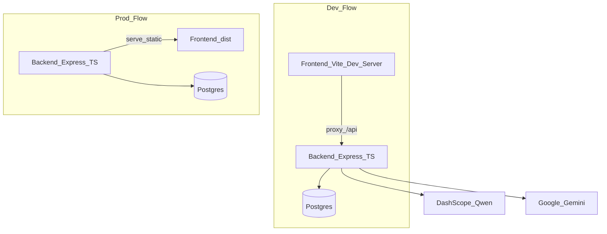

# PawTrace 完整前后端改造计划

## 目标状态（你选定的技术路线）

- **前端**：React + TypeScript + Vite + Tailwind（组件化、可维护、可构建部署）
- **后端**：Node.js + TypeScript + Express
- **数据库**：Postgres + Prisma（规范 schema/迁移/种子数据）
- **鉴权**：默认采用 **JWT（Access Token）** + 密码哈希（bcrypt/argon2）
- **AI**：保留后端代理（Qwen / Gemini），前端不接触密钥

## 现状关键点（来自当前仓库）

- 当前推荐启动是 `backend/server.js` 同时托管静态与 API，`frontend/dist` 不存在会回退托管 `frontend/` 源码（需改成标准 dev/prod 分离）
- 后端路由集中在 `[backend/routes/registerRoutes.js](backend/routes/registerRoutes.js)`，包含：
  - pets/users/chat/history/status/location/health/nfc/monitor 等
- AI 相关在 `[backend/services/aiService.js](backend/services/aiService.js)` 及路由中调用 DashScope/Gemini
- 前端现在是原生 JS，大体入口为 `frontend/src/main.js`，且 `frontend/src/app.js` 过大（需拆分/重写为 React 组件）

## 目标架构（开发与生产）

## 目录与脚本（规划）

- 根目录使用 workspaces（或保持简单的 `--prefix`，但会统一成标准体验）
- 预期结构：
  - `backend/`：TS 源码、Prisma schema、迁移、路由、服务
  - `frontend/`：React 应用（Vite）
  - `packages/shared/`（可选）：共享类型（API DTO、Zod schema）

## 具体实施步骤

### 1) 仓库卫生与可复现安装

- 增加/修正根级 `.gitignore`：忽略 `**/node_modules`、`**/.DS_Store`、本地 DB/日志、构建产物等
- 将已入库或变更中的 `backend/node_modules/**` 从版本控制中移除（保留 lockfile）
- 将本地数据库文件（如 `backend/data/pawtrace.sqlite`）改为本地生成，不再入库；提供 `seed` 和 `migrate` 代替

### 2) 后端脚手架（TS + Express + Prisma + Postgres）

- 初始化 TypeScript 工程、统一配置加载（dotenv）、结构化日志、全局错误处理
- 加入基础安全与可观测性：Helmet、CORS、压缩、请求 ID、健康检查 `/api/status`
- Prisma：建立核心模型（User、Pet、ChatMessage/Conversation、LocationPoint、HealthMeasurement、NfcCard 等）与迁移

### 3) 鉴权与权限

- 注册/登录：密码哈希、登录发 token、前端持久化（httpOnly cookie 或 localStorage，默认先做 Bearer JWT）
- 将现有“设备 token”（`x-device-token`）概念升级为：
  - 设备表 + device token 哈希存储，或保留 env 白名单但用更清晰的中间件与配置
- 对 `/api/health/*`、`/api/location/*(写)`、`/api/monitor/*`、`/api/nfc/*(签名)` 等加保护

### 4) API 迁移与兼容层

- 以当前 `[backend/routes/registerRoutes.js](backend/routes/registerRoutes.js)` 为功能清单，逐个迁移到新路由模块
- 尽量保持原有路径与响应结构，减少前端迁移成本；必要时提供 `/api/v2/*` 并在前端切换

### 5) AI 代理服务规范化

- 提供统一 `AiService`：
  - 文本聊天：Qwen compatible chat completions
  - 诊断/图像：Gemini generateContent + 兜底到 Qwen-VL（如果你仍需要）
- 标准化：超时、重试、错误码映射、返回结构（含 `source` 字段）
- 密钥管理：仅服务端读取，开发用 `.env`，生产用部署平台 secret

### 6) 前端重建（React + TS）

- 用 React Router 建路由：登录/地图/宠物/聊天/个人资料/（可选）监控
- 请求层：封装 API client（fetch/axios）+（建议）TanStack Query 做缓存与状态
- UI：Tailwind 复刻现有像素橙色风格（Font Awesome 可继续用）
- 地图：将当前 `frontend/src/map.js` 的交互迁移为 React 组件（marker、卡片、列表）

### 7) Monitor 与 NFC

- Monitor：将 `monitor/` 迁移成前端一个 route 或独立入口（取决于你想保留独立静态页还是集成）
- NFC：保留 public card 与签名 payload 流程，但把签名与验证逻辑收敛成独立 service

### 8) Dev/Prod 一键命令

- 根目录提供：
  - `npm run dev`：并发启动后端 + 前端（前端代理 `/api`）
  - `npm run build`：前端 build + 后端 build
  - `npm start`：生产模式（后端托管前端 dist）

### 9) 数据迁移

- 写一个脚本把 `backend/data/pawtrace-db.json` 导入 Postgres（Prisma client）
- 现有 demo seed（`defaultPets/defaultUsers`）改为 Prisma seed

### 10) 验证

- 冒烟：启动、注册登录、宠物 CRUD、聊天、位置/健康上报、NFC public、monitor（带 token）

## 交付物清单

- 新的 `frontend/` React+TS 工程与页面迁移
- 新的 `backend/` TS 后端 + Prisma schema + migrations + seed + import 脚本
- 根目录统一脚本与 README（开发/生产启动明确）
- `.gitignore` 与仓库清理，确保安装/启动可复现

