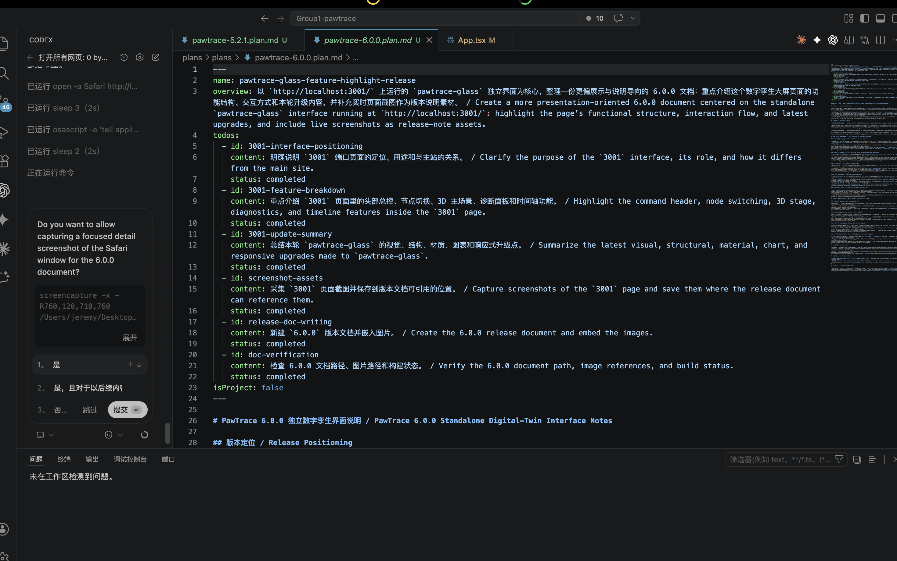
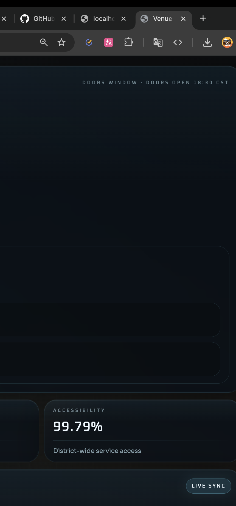

# PawTrace 6.0.0 展示端与移动壳升级日志 / PawTrace 6.0.0 Showcase and Mobile Shell Release Log

## 版本定位 / Release Positioning

- **6.0.0 当前重点 / 6.0.0 Focus**：把 `pawtrace-glass` 从独立 demo 提升为更完整的“数字孪生指挥大屏”，同时补齐主站 `frontend` 在移动端壳层、聊天导航、健康录入和原生容器接入上的落地工作 / Elevate `pawtrace-glass` from a standalone demo into a fuller digital-twin command dashboard while also shipping tangible work in the main `frontend` across mobile shell behavior, chat navigation, health input, and native-container integration.
- **主界面分层 / Release Surface Split**：本次版本不是只改一个页面，而是覆盖三条线：`3001` 端口展示界面、主站移动端可用性、Capacitor iOS App 壳 / This release is not a single-page pass but a three-lane update: the `3001` showcase interface, the main-site mobile usability layer, and the Capacitor iOS app shell.
- **版本关键词 / Release Keywords**：数字孪生大屏、HUD 重构、目标矩阵、3D 主舞台、诊断图表、移动端壳层收口、聊天导航修整、健康表单适配、Capacitor、iOS 启动资产 / digital-twin dashboard, HUD rebuild, target matrix, 3D main stage, diagnostics charts, mobile shell tightening, chat navigation polish, health-form adaptation, Capacitor, and iOS launch assets.

## 界面预览 / Interface Preview

桌面截图展示了 `pawtrace-glass` 在 6.0.0 中作为展示级指挥台的完整形态：上方是任务级总控，左侧是目标切换和雷达，中央是 3D 主舞台，右侧是诊断与图表信息。 / The desktop capture shows `pawtrace-glass` in its 6.0.0 form as a presentation-grade command surface: mission-level control on top, target switching and radar on the left, a 3D main stage in the center, and diagnostics plus charts on the right.

窄屏截图说明这个页面在更小宽度下仍保留 HUD 语义和关键信息块，没有退化成普通堆叠列表。 / The narrow-view capture shows that the interface keeps its HUD semantics and critical modules even at constrained widths instead of collapsing into a generic stack.

## 6.0.0 完整更新内容 / Full Update Scope in 6.0.0

### 1) `pawtrace-glass` 的展示定位被正式拉高 / `pawtrace-glass` Was Repositioned as a Flagship Showcase

- `http://localhost:3001/` 不再只被描述为一个独立页面，而是被单独包装成 PawTrace 的“高表现数字孪生看板” / `http://localhost:3001/` is no longer framed as just another standalone page but as PawTrace’s high-presence digital-twin dashboard.
- 页面命名、结构说明和截图素材都围绕“可演示、可汇报、可答辩”的展示语境重新组织 / The naming, structural descriptions, and screenshots are now organized around demo, briefing, and presentation contexts.
- 6.0.0 的日志口径从“页面说明”升级成“版本发布说明”，让这套界面更像独立成果而不是附属页面 / The 6.0.0 documentation now reads like a proper release note rather than a page memo, making the interface feel like an independent deliverable.

### 2) 大屏视觉语言与信息架构继续拉开差距 / The Dashboard Visual Language and Information Architecture Were Further Expanded

- 顶部头部区维持 `District Digital Twin` 和 `Venue Pulse Twin` 的总控语义，突出节点数量、当前 focus、项目背景和英雄指标 / The header keeps the `District Digital Twin` and `Venue Pulse Twin` command-deck framing, emphasizing node count, current focus, project context, and hero metrics.
- 左侧控制区被清晰组织为 `Command Deck + Target Matrix + Sector Radar`，让用户在进入 3D 场景前先读懂系统态势 / The left rail is now clearly organized as `Command Deck + Target Matrix + Sector Radar`, so users understand system state before engaging with the 3D stage.
- 中央舞台与底部时间轴连成完整演示路径，用户可以按节点切换顺序完成一整套讲解 / The center stage and bottom timeline now form a coherent walkthrough path that supports a full demo sequence across nodes.
- 右侧诊断区被稳定拆分成概览、网络、告警和图表四层，页面阅读顺序更接近真实监控面板 / The right diagnostics stack is stabilized into overview, network, alerts, and charts, giving the page a more realistic monitoring-panel reading flow.

### 3) 左侧目标矩阵、雷达和节点浏览更像“系统界面” / Left-Side Target Browsing Now Feels Like a System Interface

- `FocusRail` 升级成 `Target Matrix` 后，节点不再只是名字列表，而是带有序号、模型标签、状态、扇区与锚点信息的目标卡 / After upgrading `FocusRail` into `Target Matrix`, nodes are no longer just names but target cards carrying sequence, model labels, status, sector, and anchor details.
- 活跃节点摘要区强化了 slot、锁定点、响应状态和类目语义，提升当前 focus 的“被系统选中”感 / The active-node summary emphasizes slot, lock point, response state, and category semantics, strengthening the sense that the current focus is system-selected.
- `MinimapCard` 进一步包装成 `Sector Radar`，通过同心圆、连线、发光点和扫掠感表达节点关系，而不是单纯的装饰性缩略图 / `MinimapCard` is further framed as `Sector Radar`, using rings, connections, glow points, and sweep cues to express node relationships instead of acting as a decorative minimap.

### 4) 3D 主舞台从“看模型”升级为“控场景” / The 3D Stage Shifted from Model Viewing to Scene Control

- 3D 场景继续承载点击节点切换、镜头重锁定和空白区域重置逻辑，保留原有交互能力 / The 3D scene keeps node-click focus switching, camera relocking, and empty-area reset behaviors, preserving the original interaction capability.
- HUD 覆层、准星、锁定环和底部状态条使场景具备了更强的主舞台属性，而不是孤立的三维展示模块 / HUD overlays, reticles, lock rings, and the bottom status strip make the scene feel like the operational centerpiece instead of an isolated 3D viewer.
- 场馆、城市节点和灯光继续统一在冷色科技体系中，让 3D 区域与 2D 诊断面板保持同一语言 / Stadium materials, city nodes, and lighting continue to align under a cold-tech palette so the 3D area matches the 2D diagnostic panels.
- 时间轴与镜头切换配合后，页面已经具备“顺序演示多个关键节点”的完整节奏 / Together with the timeline, camera switching now supports a clear sequence for presenting multiple critical nodes.

### 5) 诊断、指标和图表从“普通卡片”升级为“态势面板” / Diagnostics, Metrics, and Charts Were Reworked into a Situational Panel

- `InfoPanel` 侧重 `Node Diagnostics` 叙事，不再只是把指标堆在右侧，而是给当前节点一个稳定的解释入口 / `InfoPanel` now leans into the `Node Diagnostics` narrative, providing a stable interpretive entry point instead of simply stacking metrics on the right.
- `Network Snapshot` 将可用性、覆盖和时延包装成更明确的监控块，让网络健康度更容易口述和比较 / `Network Snapshot` packages availability, coverage, and latency into clearer monitoring blocks, making network health easier to narrate and compare.
- `Operational Alerts` 被独立出来，便于将节点风险和系统提示作为演示重点单独讲解 / `Operational Alerts` are isolated so node risks and system prompts can be presented as first-class talking points.
- 图表命名延续 `Flux Graph` 与 `Reliability Envelope` 这种更偏系统语感的命名方式，避免通用图表标题显得太“模板化” / The chart naming keeps system-oriented labels like `Flux Graph` and `Reliability Envelope`, avoiding generic chart titles that feel too templated.

### 6) 主站 `frontend` 的移动端壳层和页面细节被补齐 / The Main `frontend` Mobile Shell and Page Details Were Tightened

- `@media (max-width: 768px)` 下收起部分背景光斑、登录页装饰卡和大型头部壳层，减少移动端首屏视觉噪声 / Under `@media (max-width: 768px)`, large glow ornaments, decorative login blocks, and heavy shell chrome are suppressed to reduce first-screen noise on mobile.
- `app-shell-wrapper`、`app-main`、`tab-page` 和 `page-section` 的宽度约束被放开到更贴近小屏设备的状态，避免壳层把内容挤窄 / Width constraints across `app-shell-wrapper`, `app-main`, `tab-page`, and `page-section` are relaxed for small screens so the shell no longer squeezes content excessively.
- 社区宠物网格、注册表单和社区骨架在移动端被重排成更可用的两列节奏，避免卡片比例失控 / The community pet grid, register form, and community skeleton are rebalanced for mobile so card proportions stay usable instead of breaking apart.
- AI 概览卡被单独增加 `ai-summary-card` 语义类名，用于在小屏时强制单列展开，避免两张摘要卡并排过窄 / AI summary cards now use the dedicated `ai-summary-card` class to force cleaner single-column behavior on small screens.
- 底部移动端 tab bar 进一步压缩间距，并在最窄宽度下隐藏文字只保留图标，给有限宽度腾出更多可点击空间 / The mobile bottom tab bar is tightened further, and at the narrowest width hides labels in favor of icons to reclaim touch space.

### 7) 聊天、健康页和宠物列表的交互被补了几个关键缺口 / Chat, Health, and Pet-List Interactions Got Practical Fixes

- 聊天页增加 `Show friends` 和 `Friends` 两个回跳按钮，补足小屏下联系人面板与会话面板之间的切换路径 / The chat page now has `Show friends` and `Friends` actions to restore a reliable switching path between the contacts pane and the active conversation on small screens.
- 移动端聊天布局调整了左右区块顺序，默认先展示会话主区域，再按需切换回联系人列表，更接近常见消息应用行为 / The mobile chat layout reorders its panes so the conversation surface takes priority and the contacts pane becomes an explicit secondary destination, closer to familiar messaging apps.
- 健康记录页的宠物选择器被拆出 `health-pet-select-row` 和 `health-pet-select`，在手机宽度下会自动改为纵向布局并占满宽度 / The health-record pet selector now uses `health-pet-select-row` and `health-pet-select` so it can switch into a full-width vertical layout on phones.
- 宠物列表在移动端不再默认展开第一张卡片，避免一进页面就被单个 pet 卡片撑长整个首屏 / The pet list no longer auto-opens the first card on mobile, preventing one pet from stretching the entire first screen by default.

### 8) Capacitor 与 iOS App 壳正式落地到仓库 / Capacitor and the iOS App Shell Were Added to the Repository

- `frontend/package.json` 新增 `@capacitor/core`、`@capacitor/cli`、`@capacitor/android`、`@capacitor/ios` 依赖和 `cap:sync / cap:open:android / cap:open:ios` 脚本，说明主站已经不再只面向浏览器 / `frontend/package.json` now includes `@capacitor/core`, `@capacitor/cli`, `@capacitor/android`, and `@capacitor/ios` plus `cap:sync / cap:open:android / cap:open:ios`, signaling that the main frontend is no longer browser-only.
- `capacitor.config.ts` 补充了统一背景色、iOS `contentInset: 'always'` 和 `SystemBars.insetsHandling: 'css'` 配置，开始处理 WebView 与安全区域的一致性 / `capacitor.config.ts` now includes a unified background color, iOS `contentInset: 'always'`, and `SystemBars.insetsHandling: 'css'`, starting to align WebView behavior with safe-area handling.
- 仓库新增 `frontend/ios/` 原生工程，包括 `AppDelegate.swift`、`Info.plist`、`Main.storyboard`、`LaunchScreen.storyboard` 和 Xcode 项目文件，iOS 容器已经具备基础可打开能力 / The repo now contains a generated `frontend/ios/` native project, including `AppDelegate.swift`, `Info.plist`, `Main.storyboard`, `LaunchScreen.storyboard`, and Xcode project files, so the iOS container has a baseline launchable structure.
- App Icon、Splash 资源和 `CapApp-SPM` 支撑文件一并进入版本范围，说明这次不是停留在“装依赖”，而是把原生包装走到了资产接入层 / App icon assets, splash assets, and supporting `CapApp-SPM` files are included as well, meaning this pass goes beyond dependency setup into actual native packaging assets.
- `Info.plist` 已声明 iPhone / iPad 方向支持和启动图配置，为后续真机安装、状态栏和安全区调试打下基础 / `Info.plist` already declares phone/tablet orientation support and launch-screen configuration, laying groundwork for device installs and safe-area debugging.

### 9) 文档素材和版本展示材料也被补齐 / Documentation Assets and Release Materials Were Also Strengthened

- `plans/images/6.0.0/` 中保留了桌面与窄屏截图，使版本日志可以直接作为展示材料使用 / Desktop and narrow-view screenshots are preserved under `plans/images/6.0.0/`, letting the release log double as showcase material.
- 6.0.0 文档本身从偏说明性的单页整理成更完整的升级日志，能同时覆盖“展示端、主站壳层、原生包装”三条更新线 / The 6.0.0 document itself has been expanded from a page note into a fuller release log that can cover showcase UI, main-site shell work, and native packaging in one place.
- 版本叙述不再只强调“做了一个页面”，而是能解释这批工作为什么能被看成一次阶段性升级 / The release narrative now explains why this work qualifies as a meaningful milestone instead of reading as “we updated one page.”

## 涉及文件范围 / File Scope

- 大屏展示端 / Showcase dashboard:
  [App.tsx](/Users/jeremy/Desktop/Group1-pawtrace/pawtrace-glass/src/App.tsx:1),
  [HudHeader.tsx](/Users/jeremy/Desktop/Group1-pawtrace/pawtrace-glass/src/components/HudHeader.tsx:1),
  [FocusRail.tsx](/Users/jeremy/Desktop/Group1-pawtrace/pawtrace-glass/src/components/FocusRail.tsx:1),
  [MinimapCard.tsx](/Users/jeremy/Desktop/Group1-pawtrace/pawtrace-glass/src/components/MinimapCard.tsx:1),
  [Timeline.tsx](/Users/jeremy/Desktop/Group1-pawtrace/pawtrace-glass/src/components/Timeline.tsx:1),
  [InfoPanel.tsx](/Users/jeremy/Desktop/Group1-pawtrace/pawtrace-glass/src/panels/InfoPanel.tsx:1),
  [MetricCard.tsx](/Users/jeremy/Desktop/Group1-pawtrace/pawtrace-glass/src/panels/MetricCard.tsx:1),
  [ChartPanel.tsx](/Users/jeremy/Desktop/Group1-pawtrace/pawtrace-glass/src/panels/ChartPanel.tsx:1),
  [SceneCanvas.tsx](/Users/jeremy/Desktop/Group1-pawtrace/pawtrace-glass/src/scene/SceneCanvas.tsx:1),
  [SceneLights.tsx](/Users/jeremy/Desktop/Group1-pawtrace/pawtrace-glass/src/scene/SceneLights.tsx:1),
  [CityLayer.tsx](/Users/jeremy/Desktop/Group1-pawtrace/pawtrace-glass/src/scene/CityLayer.tsx:1),
  [StadiumModel.tsx](/Users/jeremy/Desktop/Group1-pawtrace/pawtrace-glass/src/scene/StadiumModel.tsx:1),
  [chartOptions.ts](/Users/jeremy/Desktop/Group1-pawtrace/pawtrace-glass/src/utils/chartOptions.ts:1),
  [index.css](/Users/jeremy/Desktop/Group1-pawtrace/pawtrace-glass/src/index.css:1)
- 主站移动端与交互 / Main frontend mobile and interaction polish:
  [index.html](/Users/jeremy/Desktop/Group1-pawtrace/frontend/index.html:1),
  [app.js](/Users/jeremy/Desktop/Group1-pawtrace/frontend/public/app/app.js:1),
  [style.tailwind.css](/Users/jeremy/Desktop/Group1-pawtrace/frontend/public/app/style.tailwind.css:1)
- 原生容器与包装 / Native container and packaging:
  [package.json](/Users/jeremy/Desktop/Group1-pawtrace/frontend/package.json:1),
  [capacitor.config.ts](/Users/jeremy/Desktop/Group1-pawtrace/frontend/capacitor.config.ts:1),
  [Info.plist](/Users/jeremy/Desktop/Group1-pawtrace/frontend/ios/App/App/Info.plist:1),
  [AppDelegate.swift](/Users/jeremy/Desktop/Group1-pawtrace/frontend/ios/App/App/AppDelegate.swift:1),
  [LaunchScreen.storyboard](/Users/jeremy/Desktop/Group1-pawtrace/frontend/ios/App/App/Base.lproj/LaunchScreen.storyboard:1),
  [project.pbxproj](/Users/jeremy/Desktop/Group1-pawtrace/frontend/ios/App/App.xcodeproj/project.pbxproj:1)
- 文档与素材 / Release notes and assets:
  [pawtrace-6.0.0.plan.md](/Users/jeremy/Desktop/Group1-pawtrace/plans/plans/pawtrace-6.0.0.plan.md:1),
  [pawtrace-glass-dashboard-desktop.png](/Users/jeremy/Desktop/Group1-pawtrace/plans/images/6.0.0/pawtrace-glass-dashboard-desktop.png),
  [pawtrace-glass-dashboard-mobile.png](/Users/jeremy/Desktop/Group1-pawtrace/plans/images/6.0.0/pawtrace-glass-dashboard-mobile.png)

## 交付量总结 / Delivery Summary

- `pawtrace-glass` 工作区本轮涉及 15 个核心文件，界面、场景、图表、样式四个层面都有明显改动 / The `pawtrace-glass` workstream touches 15 core files spanning UI, scene, chart, and styling layers.
- `frontend` 已暂存改动涉及 25 个文件，其中包含原生 iOS 工程、配置、样式和页面交互补丁 / The staged `frontend` work covers 25 files, including a native iOS project, configuration, style changes, and page-interaction patches.
- 如果以版本叙事来总结，这不是“做了一个新皮肤”，而是一次同时覆盖展示面、主站移动端和原生包装链路的阶段升级 / Framed as a release, this is not just a skin refresh but a milestone that spans the showcase surface, the main-site mobile UX, and the native packaging path.

## 验证状态 / Verification Status

- 已完成 `npm run build --prefix frontend`，主站前端构建通过 / `npm run build --prefix frontend` completed successfully.
- 已完成 `npm run build --prefix pawtrace-glass`，独立大屏构建通过 / `npm run build --prefix pawtrace-glass` completed successfully.
- `pawtrace-glass` 当前仍存在 Vite 的大包体 warning，但不阻塞本次版本说明和页面交付 / `pawtrace-glass` still emits a Vite large-bundle warning, but it does not block this release note or the current page delivery.

## 已知边界 / Known Boundaries

- 本轮日志聚焦前端展示、移动端和原生壳，不包含 `backend` 的接口与数据模型扩展 / This release log focuses on frontend showcase, mobile UX, and native shell work; it does not include backend API or data-model expansion.
- iOS 容器已经进入工程和资产接入阶段，但还没有引入更多原生业务能力插件 / The iOS container is now in place with project and asset setup, but broader native business-capability plugins have not been introduced yet.

## 下一步建议 / Recommended Next Step

- 如果你还想让更新日志“更像大版本”，下一步可以继续补一段 `6.0.0 用户价值总结` 和 `6.0.0 演示脚本`，把这些更新翻译成对老师、客户或评审更容易理解的话术 / If you want the log to feel even more like a major release, the next addition should be a `6.0.0 user-value summary` and a `6.0.0 demo script` so the technical changes translate cleanly for teachers, clients, or reviewers.
